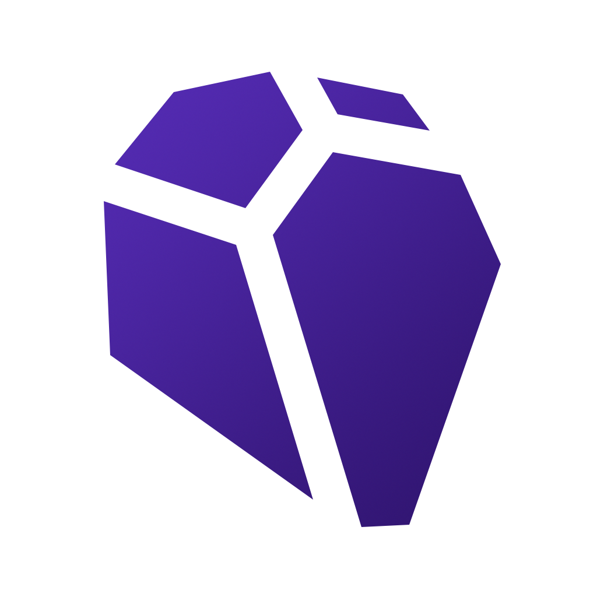

# 中臺機器人研究社 | Robot Research Club of CTUST

<div align="center">
  
  <h3>從創意到實戰，打造你的機器人宇宙</h3>
  <p>一個由中臺科技大學學生組成的社團，主要研究機器人技術，並且提供學生一個學習機器人技術的平台。</p>
</div>

---

## 🚀 專案概覽

這是一個現代化的社團網站，採用 **Next.js 15** + **TypeScript** 構建，提供完整的社團資訊展示、活動管理、用戶互動等功能。網站具備響應式設計、深色模式、多語系支援等現代化特性。

### 🌟 主要特色

- **現代化設計** - 採用 SCSS 模組化樣式，支援深色/淺色主題切換
- **響應式佈局** - 完美適配桌面、平板、手機等各種設備
- **完整認證系統** - 整合 Firebase Authentication，支援 Google 登入
- **即時資料管理** - 使用 Firestore 資料庫進行即時資料同步
- **行事曆系統** - 整合 FullCalendar 提供豐富的日程管理功能
- **競賽管理** - 完整的競賽資訊展示與時間軸追蹤
- **Markdown 編輯器** - 支援即時預覽的內容編輯系統
- **PWA** - 漸進式網頁應用程式
- 🔍 **SEO 優化** - 完整的 meta 標籤、sitemap 生成
- ⚡ **效能監控** - 整合 Vercel Analytics 和 Speed Insights
- 🌍 **國際化支援** - 使用 next-intl 實現多語系功能

---

## 🛠️ 技術棧

### 核心技術

- **框架**: [Next.js 15](https://nextjs.org/) - React 全端框架
- **語言**: [TypeScript](https://www.typescriptlang.org/) - 型別安全的 JavaScript
- **樣式**: [SCSS](https://sass-lang.com/) + [Tailwind CSS 4](https://tailwindcss.com/) - 模組化樣式解決方案
- **資料庫**: [Firebase Firestore](https://firebase.google.com/products/firestore) - NoSQL 雲端資料庫

### UI/UX 增強

- **字體**: [Noto Sans TC](https://fonts.google.com/noto/specimen/Noto+Sans+TC) - 繁體中文優化字體
- **圖示**: [FontAwesome](https://fontawesome.com/) - 豐富的圖示庫
- **主題**: [next-themes](https://github.com/pacocoursey/next-themes) - 深色模式支援
- **動效**: [liquid-glass-react](https://www.npmjs.com/package/liquid-glass-react) - 玻璃擬態效果

### 功能性套件

- **認證**: [Firebase Authentication](https://firebase.google.com/products/auth) - 用戶認證系統
- **表單**: [React Hook Form](https://react-hook-form.com/) + [Yup](https://github.com/jquense/yup) - 表單驗證
- **日期**: [Moment.js](https://momentjs.com/) - 日期時間處理
- **日曆**: [FullCalendar](https://fullcalendar.io/) - 專業日曆組件
- **Markdown**: [React Markdown](https://github.com/remarkjs/react-markdown) - Markdown 渲染
- **國際化**: [next-intl](https://next-intl-docs.vercel.app/) - 多語系支援

### 開發工具

- **程式碼品質**: [ESLint](https://eslint.org/) - 程式碼檢查
- **部署**: [Vercel](https://vercel.com/) - 自動化部署
- **分析**: [Vercel Analytics](https://vercel.com/analytics) + [Speed Insights](https://vercel.com/docs/speed-insights) + [Google Analytics](https://analytics.google.com)
- **SEO**: [next-sitemap](https://github.com/iamvishnusankar/next-sitemap) - 自動 sitemap 生成 + 結構化 Metadata 生成(/app/utils/metadata.ts)

---

## 📁 專案結構

```txt
robot-ctust/
├── app/                          # Next.js App Router
│   ├── components/               # 可重用元件
│   │   ├── Auth/                # 認證相關元件
│   │   ├── CompetitionCard/     # 競賽卡片元件
│   │   ├── CompetitionTimeline/ # 競賽時間軸
│   │   ├── CreatePostModal/     # 文章建立模組
│   │   ├── Footer/              # 頁尾元件
│   │   ├── Header/              # 導航列元件
│   │   ├── Markdown/            # Markdown 編輯器
│   │   ├── Menu/                # 行動版選單
│   │   ├── Selector/            # 選擇器元件
│   │   └── ThemeToggle/         # 主題切換器
│   ├── contexts/                # React Context
│   │   ├── AuthContext.tsx      # 認證狀態管理
│   │   ├── HeaderContext.tsx    # 導航列狀態
│   │   └── ThemeContext.tsx     # 主題狀態管理
│   ├── hooks/                   # 自訂 Hooks
│   ├── types/                   # TypeScript 型別定義
│   ├── utils/                   # 工具函數
│   ├── styles/                  # 全域樣式
│   ├── about/                   # 關於頁面
│   ├── admin/                   # 管理後台
│   ├── blog/                    # 部落格系統
│   ├── competitions/            # 競賽管理
│   ├── docs/                    # 文檔系統
│   ├── schedules/               # 行事曆
│   ├── update/                  # 最新資訊
│   └── user/                    # 用戶頁面
├── public/                      # 靜態資源
│   ├── assets/                  # 圖片、圖示
│   └── docs/                    # 文檔檔案
├── i18n/                        # 國際化設定
├── messages/                    # 多語系訊息
└── 設定檔案                      # 各種配置文件
```

---

## 🎯 核心功能

### 🏠 首頁展示

- **社團介紹** - 展示社團理念與學習方式
- **視覺設計** - 機器人主題的現代化設計
- **響應式佈局** - 適配各種螢幕尺寸

### 👤 用戶系統

- **Google 登入** - 整合 Google OAuth 認證
- **用戶資料管理** - 個人資訊與頭像展示
- **權限控制** - 超級管理員權限管理

### 📅 行事曆系統

- **FullCalendar 整合** - 專業的日曆顯示
- **多視圖模式** - 月視圖、週視圖、日視圖
- **活動管理** - 新增、編輯、刪除活動
- **即時同步** - Firestore 即時資料更新

### 🏆 競賽管理

- **競賽展示** - 卡片式競賽資訊展示
- **時間軸追蹤** - 詳細的競賽進程時間軸
- **狀態管理** - 報名中、進行中、已完成等狀態
- **分類篩選** - 依據層級、狀態等條件篩選

### 📝 內容管理

- **Markdown 編輯器** - 支援即時預覽
- **語法高亮** - 程式碼區塊語法高亮
- **圖片上傳** - Firebase Storage 圖片管理
- **SEO 優化** - 自動生成 meta 標籤

### 📚 文檔系統

- **結構化文檔** - 清晰的文檔分類
- **搜尋功能** - 快速找到所需內容
- **版本控制** - 文檔更新歷史追蹤

### 🎨 主題系統

- **深色/淺色模式** - 自動適應系統偏好
- **顏色變數** - CSS 變數統一管理
- **動態主題色** - 根據主題調整 meta 標籤

---

## 📱 響應式設計

網站採用行動優先的響應式設計，確保在各種設備上都有良好的使用體驗：

- 桌面版 (≥1025px)
- 平板版 (600px - 1024px)
- 手機版 (<600px)

---

## 🎨 設計系統

### 色彩系統

使用 oklch 色彩系統。

- **主色調**: 水晶紫 (oklch(0.5 0.24 290))
- **輔助色**: 科技藍 (oklch(0.5 0.24 230))
- **中性色**: 現代灰階系統

### 字體系統

- **字體**: Noto Sans TC

### 間距系統

- 採用 6px 基準網格
- 一致的內外邊距規範
- 響應式間距調整

---

## 🔒 安全性

### 認證安全

- Firebase Authentication 託管認證
- JWT Token 自動管理
- 安全的使用者資料同步

### 資料安全

- Firestore 安全規則
- 使用者權限驗證
- 敏感資料過濾

---

## ⚡ 效能優化

### 載入優化

- Next.js 自動程式碼分割
- 圖片懶載入與優化
- 字體預載入策略

### 快取策略

- 靜態資源快取
- API 回應快取
- 瀏覽器快取優化

### 監控分析

- Vercel Analytics 使用分析
- Speed Insights 效能監控
- Core Web Vitals 追蹤

---

## 🌍 國際化（規劃中）

### 支援語言

- 繁體中文 (zh-TW) - 預設
- 英文 (en) - 規劃中

### 預計實作

- next-intl 完整整合
- 動態語言切換
- SEO 友善的多語系 URL

---

## 📈 SEO 優化

### 技術 SEO

- 自動 sitemap 生成
- 結構化資料標記
- 語意化 HTML 結構

### 內容 SEO

- 動態 meta 標籤
- Open Graph 標籤
- Twitter Card 支援

### 效能 SEO

- Core Web Vitals 優化
- 圖片最佳化
- 載入速度優化

---

## 🤝 貢獻指南

我們歡迎所有形式的貢獻！請參考以下步驟：

1. **Fork 專案**
2. **建立功能分支** (`git checkout -b feature/AmazingFeature`)
3. **提交變更** (`git commit -m 'Add some AmazingFeature'`)
4. **推送到分支** (`git push origin feature/AmazingFeature`)
5. **開啟 Pull Request**

### 開發規範

- 遵循 TypeScript 嚴格模式
- 使用 ESLint 程式碼檢查
- 撰寫清晰的提交訊息
- 添加適當的測試

---

## 📞 聯絡資訊

- **社團**: 中臺機器人研究社
- **學校**: 中臺科技大學
- **網站**: [中臺機器人研究社｜Robot Research Club of CTUST](https://robotctust.com/)

---

## 📄 授權條款

本專案採用 MIT 授權條款 - 詳見 [LICENSE](LICENSE) 檔案

---

<div align="center">
  <p>Made with passion by John Lin</p>
  <p>© 2025 Robot Research Club of CTUST. All rights reserved.</p>
</div>
